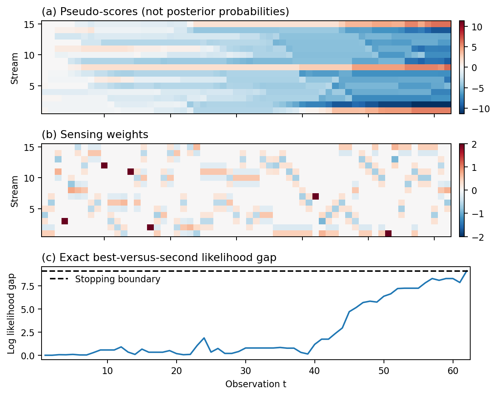

# Active Hypothesis Testing for Correlated Combinatorial Anomaly Detection

<div align="center">

[](https://arxiv.org/abs/2601.17430)
&nbsp;&nbsp;&nbsp;&nbsp;&nbsp;
[](https://huggingface.co/papers/2601.17430)

**[Paper](https://arxiv.org/abs/2601.17430)** | **[Hugging Face](https://huggingface.co/papers/2601.17430)**

</div>

This repository contains the official implementation of ECC-AHT, a sequential
active hypothesis testing algorithm for correlated combinatorial anomaly detection.

## 📰 News

- **[1/26/2026]** Preprint available on [arXiv](https://arxiv.org/abs/2601.17430)
- **[1/24/2026]** Code and experiments released

## ⭐ Overview

ECC-AHT addresses the problem of identifying a small set of anomalous streams under
correlated Gaussian noise. The algorithm combines:

- correlation-aware measurement design,
- Champion–Challenger hypothesis comparison,
- scalable pseudo-likelihood inference.

The revised theory separates two procedures. An enumerative, non-oracle two-stage
construction attains the controlled-sensing information rate for fixed finite
hypothesis families. ECC-AHT uses persistent coordinate exploration and
exact all-hypothesis likelihood verification; it is delta-correct with finite mean
stopping time, but no rate-optimality theorem is claimed for this heuristic.



## 📄 License

This project is licensed under the [MIT License](https://github.com/VincentdeCristo/ECC-AHT/blob/main/LICENSE).

## 🚀 Quick Start

### 🧪 Configure environment

```bash
mamba create -n eccaht python=3.12.11
mamba activate eccaht
mamba install --file requirements.txt
```

### Revised procedures

`revised_fixed_confidence.py` implements the revised theorem and algorithm under
one exact decision protocol. It enumerates all size-`n` hypotheses, so use small
`K` unless the resulting combinatorial cost is acceptable.

```bash
# Quick deterministic smoke run
python revised_fixed_confidence.py --K 4 --n 2 --s-star 0,3 \
  --covariances identity --deltas 0.2 --seeds 2 --max-steps 1000 \
  --out results_revised/smoke.json.gz

# Fixed-confidence coverage table used for the revised manuscript
python revised_fixed_confidence.py --K 4 --n 2 --s-star 0,3 \
  --covariances identity,toeplitz --rho 0.5 \
  --deltas 0.05,0.01 --seeds 3000 --max-steps 5000 \
  --out results_revised/coverage.json.gz

# Asymptotic-rate figure used for the revised manuscript
python revised_fixed_confidence.py --K 4 --n 2 --s-star 0,3 \
  --covariances identity,toeplitz --rho 0.5 \
  --deltas 1e-3,1e-6,1e-12,1e-24,1e-48 --seeds 300 --max-steps 5000 \
  --out results_revised/rate_tail.json.gz

python make_revised_fixed_confidence_figure.py results_revised/rate_tail.json.gz

python -m unittest -v test_revised_fixed_confidence.py
```

The three methods are `two_stage` (the non-oracle attaining construction),
`ecc` (Algorithm 1), and `oracle_design` (a diagnostic
reference that knows the true set only for sensing). Every output decision is
the exact maximum-likelihood subset and must beat every alternative by
`log((M-1)/delta)`. JSON output includes raw trials, timeout counts, capped and
stopped-only sample summaries, the numerical SDP rate, normalized sample size, and
a one-sided 95% Clopper--Pearson error bound.

### Algorithm 1 trajectories, sweeps, and ablations

```bash
python experiment_algorithm1.py --selftest
python experiment_algorithm1.py --seeds 300 --max-steps 5000
python plot_algorithm1.py
```

These commands produce all 45 new settings (13,500 trials) and the fixed-seed
trajectory used in the manuscript. The compressed raw trials, seeds, source hashes,
solver diagnostics, figures, and generated LaTeX table are in `results_algorithm1/`.
One weak-signal trial (shift 0.5) reached the 5000-step cap; all other trials
stopped. Sweep means retain the censored trial at the cap, and the figure marks it. All reported ECC-AHT results use Algorithm 1: stable score-based
pair selection, precision-weighted contrast, persistent coordinate exploration,
and exact likelihood stopping. Controls change the stated sensing component:
plain contrast, uniform coordinates, random pair, or zero exploration.
The zero-exploration ablation has no general finite-termination guarantee.
Other controls use the same likelihood boundary.

The budget and ablation sweeps use paired seeds. Other configurations use separate
deterministic seeds. For identity and equicorrelated covariance, the exact
analytic contrast avoids spurious inverse-roundoff weights; ECC-AHT and the
plain-contrast control have identical coupled trajectories. Toeplitz results show that the plain-contrast
ablation can require fewer samples than ECC-AHT; pairwise optimality is not
overall sample optimality. These controls are not a state-of-the-art comparison.

The existing `results_revised/*.json.gz` files were generated by the same
Algorithm 1 and retain their original internal method key `verified_ecc`
for provenance. This is a compatibility alias for `ecc`, not a second algorithm.
The plotter accepts either key and labels the procedure **ECC-AHT**.
SDP values are floating-point numerical estimates, not certified intervals.

### 📊 Reproducing the arXiv preprint (v1) results

The figure numbers below refer to the original arXiv preprint, which differs
from the fixed-confidence protocol above. All experiments from that version can
be reproduced using scripts

- Scalability experiment (Figure 5) & Ablation study (Figure 2)

  ```bash
  python run_simulation.py
  ```

- SOTA comparison (Figure 3, 10 -- 16)

  ```bash
  python run_tree.py
  python run_sota.py
  ```

  *Note:* To Get **Figure 19 (a), 20(a), 21(a), 22 -- 26**, you should add a line

  ```python
  Sigma += 0.01 * np.eye(K)
  ```

  after line 222.
  To Get **Figure 19(b), 20(b), 21(b)**, you should change the `rho` from `0.8` to `0.5` in line 197 and comment out all other items in line 199 of correlation_modes except for `Equicorrelation`, `Kronecker`, and `RBF`.
- Robustness analysis (Figure 6 -- 9)

  ```bash
  python run_robustness.py
  ```

- Real-World evaluation (Figure 4)
  
  First of all, apply the dataset on its [official website](https://itrust.sutd.edu.sg/itrust-labs_datasets/).
  Then:

  ```bash
  python preprocess_wadi.py
  python run_wadi_a.py
  python run_wadi_b.py
  ```

- Interpretative analysis (Figure 1)

  ```bash
  python visualize_inside_ecc_aht.py
  ```

- Limitation analysis (Table 1, Figure 17, 18)

  ```bash
  python run_experiments_spectral_rank.py
  ```

## 📧 Contact

**Authors:**
- Zichuan Yang ([2153747@tongji.edu.cn](mailto:2153747@tongji.edu.cn))
- Yiming Xing ([yimingx4@tongji.edu.cn](mailto:yimingx4@tongji.edu.cn))

**Questions?** Open an [issue](https://github.com/VincentdeCristo/ECC-AHT/issues) or email us!

## 📖 Citation

If you use this code in your research, please cite:
```bibtex
@misc{yang2026activehypothesistestingcorrelated,
      title={Active Hypothesis Testing for Correlated Combinatorial Anomaly Detection}, 
      author={Zichuan Yang and Yiming Xing},
      year={2026},
      eprint={2601.17430},
      archivePrefix={arXiv},
      primaryClass={cs.LG},
      url={https://arxiv.org/abs/2601.17430}, 
}
```
